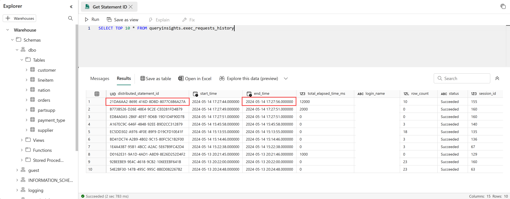
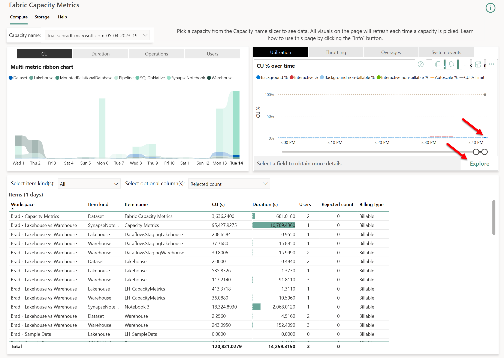
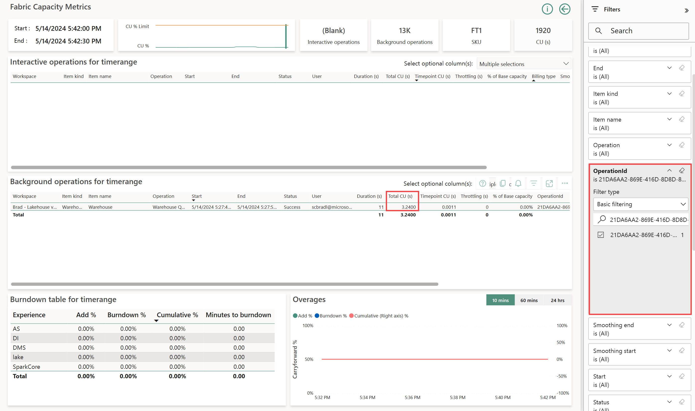
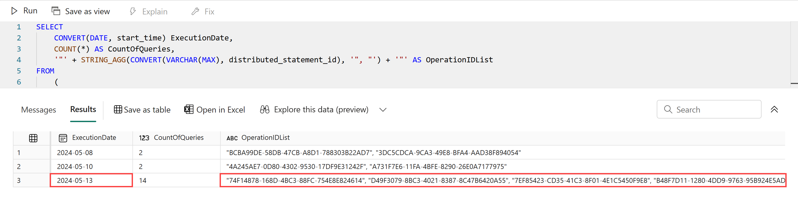
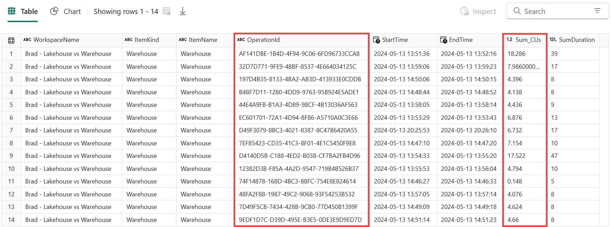

**Download the notebook used in this post from my GitHub account here:**  
[Get SQL query CUs from Capacity Metrics.ipynb](https://github.com/bradleyschacht/resources/blob/main/Fabric%20Capacity%20Metrics/Get%20SQL%20query%20CUs%20from%20Capacity%20Metrics.ipynb)

A frequent inquiry from customers goes something like this: "I ran a query on the \[data warehouse or SQL analytics endpoint\] and now I want to know how much that query cost me."

On the surface that seems easy enough. Afterall, the Capacity Metrics app tracks the usage for every operation that occurs on your Fabric capacity right down to the individual T-SQL query.

Before getting into how to get the capacity usage, let's outline the assumptions this post is going to make:

1. You understand the association between workspaces and capacities.

3. You understand the concept of smoothing as it relates to capacity usage.

## How would I do this manually?

However, when you try to use the app, you soon realize it's far more cumbersome than you'd like. This is the process you need to go through:

1. Run a query using the SQL endpoint (web browser, SSMS, ADS, etc.).

3. Gather the distributed\_statement\_id and query execution date and time from Query Insights (or capture it through another method of your choosing).



3. In the capacity metrics app, navigate to a time point that is at least 15 minutes after the query finished running.



4. Filter the background operations table to just the operations you want to see (Operation Id = distributed\_statement\_id).



It's step number 3 and 4 that cause the most pain and what we will address here today programmatically. Step 3 is just confusing for people because you need to wait for the query to show up in the report, but you need to go to "someplace after the query finishes running", usually 10-15 minutes, and find the query there. Step 4 is the bigger challenge because you need to get the list of IDs in step 2 then search for one of them in the filter in step 4, click the check the box, go back to step 2 to copy the next ID, search for it, and repeat that over for each query's distributed statement id.

The process is cumbersome for one query, it will drain your evening if you need to do this for a lot of queries, and it's just impossible if you need to do this for any number of queries at scale.

## How would I do this programmatically?

The overall process is similar: Run a query (or queries), get the distributed\_statement\_id list, look them up in the capacity metrics app.

To accomplish this programmatically we will need to make a couple of changes to the manual process above. Let's do an overview then we'll dive into details.

1. Run a query using the SQL endpoint (web browser, SSMS, ADS, etc.).

3. Gather the distributed\_statement\_id and query execution date and time from Query Insights. Turn it into a string in the format of "distributed\_statement\_id\_01", "distributed\_statement\_id\_02", "distributed\_statement\_id\_NN"

5. Enter parameters into data engineering notebook.

7. Run the notebook.

Before you try to use this method, you will need to download the notebook [Get SQL query CUs from Capacity Metrics](https://github.com/bradleyschacht/resources/blob/main/Fabric/Capacity%20Metrics/Get%20SQL%20query%20CUs%20from%20Capacity%20Metrics.ipynb) which is hosted on my GitHub account. Then, upload the notebook to a Fabric workspace. The workspace will need capacity to run the notebook. The notebook can be in any Fabric workspace; it does not need to be collocated with the Capacity Metrics app or with the workspace where your lakehouses/warehouses live. In fact, this notebook doesn't even require a lakehouse to be in the workspace to run.

Let's look at a walkthrough of this.

### Run queries

I think this is self explanatory. Run your queries however you'd like. Keep in mind that it takes several minutes for the queries to show up in Query Insights and a few more minutes to show up in the Capacity Metrics data. Just assume that you need to wait at least 15 minutes after running a query for this whole process to work (the same is true of the manual process above as we are using the same dataset).

### Gather the distributed\_statement\_id(s)

Here is where things deviate from the manual process. While we are still going to be using Query Insights, we want to combine all the distributed statement ids into a single string, grouped by the date the query was run. This is necessary for the magic of a solution that allows you to get the CUs in bulk. Consider the following query to be a guide on how to do this but by no means the only way. The key is the format: double quotes around each distributed\_statement\_id forming a comma separated list.

``` sql
SELECT
    CONVERT(DATE, start_time) ExecutionDate,
    COUNT(*) AS CountOfQueries,
    '"' + STRING_AGG(CONVERT(VARCHAR(MAX), distributed_statement_id), '", "') + '"' AS OperationIDList
FROM
    (
        SELECT
            *
        FROM queryinsights.exec_requests_history
        WHERE
            command LIKE '%%'
            AND start_time >= '2024-05-08 20:53:38.000000'
            AND start_time <= '2024-05-13 20:25:53.000000'
    ) AS queryinsights_requests
GROUP BY
    CONVERT(DATE, start_time)
```

The output from this query will provide the date the queries were executed, how many matched the subquery criteria, and the complete string of query ids. You will want to copy the ExecutionDate and the corresponding OperationIDList for the next step.



For the screenshots later in this post, I chose the 14 queries that were run on May 13th.

### Enter parameters in the notebook

The big departure from the manual process is that we will use a notebook to query the Capacity Metrics dataset to get the data we need. You will need to import the notebook to any Fabric workspace (it requires capacity to use Spark) then fill in the 5 parameters in the first code cell.

- capacity\_metrics\_workspace
    - The name of the workspace that hosts the Capacity Metrics app.

- capacity\_metrics\_dataset
    - The name of the dataset used by the Capacity Metrics app.

- capacity\_id
    - The capacity which hosted the workspace where user query were run.

- date\_of\_operations
    - This is the **ExecutionDate** column from the prior step.
    
    - The date the operations were run.

- operation\_id\_list
    - This is the **OperationIDList** column from the prior step.
    
    - The list of operations of which you want to collect the capacity unit usage.
    
    - This should be a comma separate list and each operation should be enclosed in double quotes
    
    - For example: "AAAAAAAA-BBBB-CCCC-DDDD-1234567890AB", "EEEEEEEE-FFFF-GGGG-HHHH-1234567890AB"

### Run the notebook

That's it. Run it!

After the notebook runs, scroll down to the very last cell where the dataframe will display each distributed\_statement\_id (this is the OperationID field in Capacity Metrics) the total CUs consumed by that query and some additional information.



Here you can see the total CUs for each of the 14 queries from step 2.

Did you also notice that we didn't have to deal with a timepoint? We only had to know what date the SQL query ran. You didn't even have to know the time that the query ran. The amount of time that I spend waiting for time period to show up in the capacity metrics report just so I can search for my data is wild. And it's all gone!

The magic that makes this happen is [Semantic Link](https://learn.microsoft.com/en-us/fabric/data-science/semantic-link-overview) which provides a bridge between the data engineering and Power BI experiences in Fabric. It contains a variety of functionality including refreshing semantic models, reading tables from a semantic model, listing workspaces, getting workspace information, and executing DAX statements to return a dataset from a semantic model which is what this notebook uses.

## Wrapping it up

There you have it! Now instead of looking up each query individually, you can just run a simple notebook to look up the CU usage in bulk! Let's wrap up with some key things to be aware of.

1. Here is a link to get a copy of the notebook ([Get SQL CUs from Capacity Metrics](https://github.com/bradleyschacht/resources/blob/main/Fabric%20Capacity%20Metrics/Get%20SQL%20query%20CUs%20from%20Capacity%20Metrics.ipynb)) from my GitHub account.

3. You still need Capacity Metrics. Make note of the workspace name and semantic model name. Those are needed.

5. This notebook assumes that your Capacity Metrics semantic model is refreshed. Perhaps I will extend this in the future to add model refresh.

7. You will need the ID for the capacity that runs your workspace, not just the capacity name. This is the one part that's a little more difficult than the manual approach.

9. You do need to run this notebook for each date individually. I wanted to make this as easy as possible to use, so I started simple. It's still far faster than looking up individual queries manually. The nice thing though, is you can take this notebook and wrap it in another process that can be much more flexible.  
      
    For me, I have another version of this project where I persist the data from queryinsights.exec\_requests\_history into a user table, run this notebook to get the CU information, and then update the user table with the CU usage. The next time the process runs it only looks up the queries from query insights that do NOT have any CU usage already.  
      
    You could also do this across many workspaces to centralize the data. You could parameterize this with a pipeline instead of calling it from another notebook. The possibilities are endless! Would love to hear what you have built with it though!

11. I believe there is a limit of 10,000 or 100,000 records that can be returned at any one time. Yes, those numbers are very different. I don't know this for a fact though, but I'm fairly certain that limit is in place. Which means if you have a highly used system, you may need to break the query list into chunks and feed them through. Another great reason to parameterize this and build a framework around it.

What do you think? Time saver? Did I waste my time building this?

Let me know in the comments what you think!
