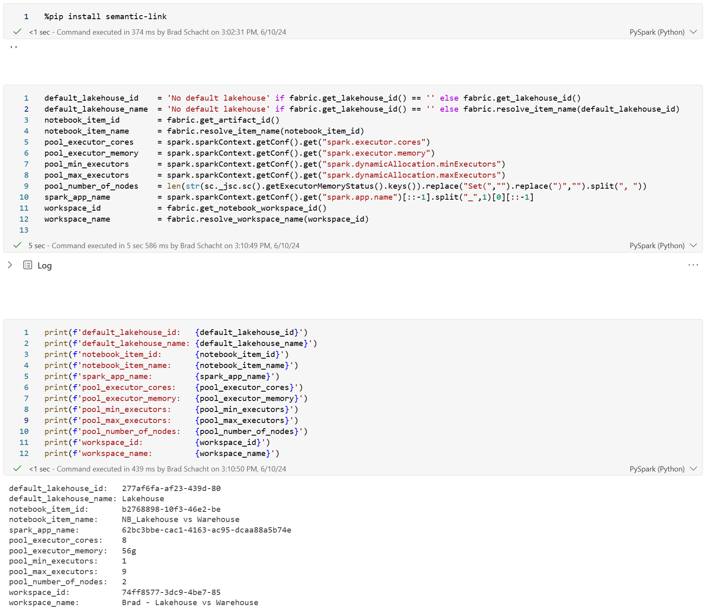

I was recently working on some tests where I needed to gather some Spark configuration information at runtime to validate that the correct environment was being used (number of executors in my case) and to log some execution details so I could look up usage in the Fabric Capacity Metrics app (the spark app name is key).

After extensive digging I was able to isolate a few different items that I felt were useful for a variety of use cases. Some of these use the [Semantic Link](https://learn.microsoft.com/en-us/python/api/semantic-link/overview-semantic-link?view=semantic-link-python) package but the most important ones for what I needed just look at the Spark configuration and require no additional packages.

Here is what I collected from the Spark configuration:

* Executor Cores
    
* Executor Memory
    
* Minimum Number of Executors
    
* Maximum Number of Executors
    
* Number of Nodes in Spark Pool
    
* Spark App Name
    

Here is what I collected from Semantic Link:

* Default Lakehouse ID
    
* Default Lakehouse Name
    
* Notebook ID
    
* Notebook Name
    
* Workspace ID
    
* Workspace Name
    

```python
%pip install semantic-link

default_lakehouse_id    = 'No default lakehouse' if fabric.get_lakehouse_id() == '' else fabric.get_lakehouse_id()
default_lakehouse_name  = 'No default lakehouse' if fabric.get_lakehouse_id() == '' else fabric.resolve_item_name(default_lakehouse_id)
notebook_item_id        = fabric.get_artifact_id()
notebook_item_name      = fabric.resolve_item_name(notebook_item_id)
pool_executor_cores     = spark.sparkContext.getConf().get("spark.executor.cores")
pool_executor_memory    = spark.sparkContext.getConf().get("spark.executor.memory")
pool_min_executors      = spark.sparkContext.getConf().get("spark.dynamicAllocation.minExecutors")
pool_max_executors      = spark.sparkContext.getConf().get("spark.dynamicAllocation.maxExecutors")
pool_number_of_nodes    = len(str(sc._jsc.sc().getExecutorMemoryStatus().keys()).replace("Set(","").replace(")","").split(", "))
spark_app_name          = spark.sparkContext.getConf().get("spark.app.name")[::-1].split("_",1)[0][::-1]
workspace_id            = fabric.get_notebook_workspace_id()
workspace_name          = fabric.resolve_workspace_name(workspace_id)

print(f'default_lakehouse_id:   {default_lakehouse_id}')
print(f'default_lakehouse_name: {default_lakehouse_name}')
print(f'notebook_item_id:       {notebook_item_id}')
print(f'notebook_item_name:     {notebook_item_name}')
print(f'spark_app_name:         {spark_app_name}')
print(f'pool_executor_cores:    {pool_executor_cores}')
print(f'pool_executor_memory:   {pool_executor_memory}')
print(f'pool_min_executors:     {pool_min_executors}')
print(f'pool_max_executors:     {pool_max_executors}')
print(f'pool_number_of_nodes:   {pool_number_of_nodes}')
print(f'workspace_id:           {workspace_id}')
print(f'workspace_name:         {workspace_name}')
```



Now I can use this in a variety of ways. For my use case, I logged all this information to a Delta table so I could track stats across each execution and tie each record back to a cost using Capacity Metrics (more on that in another post maybe).