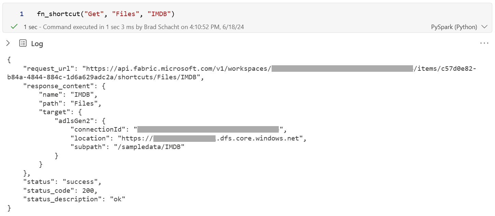
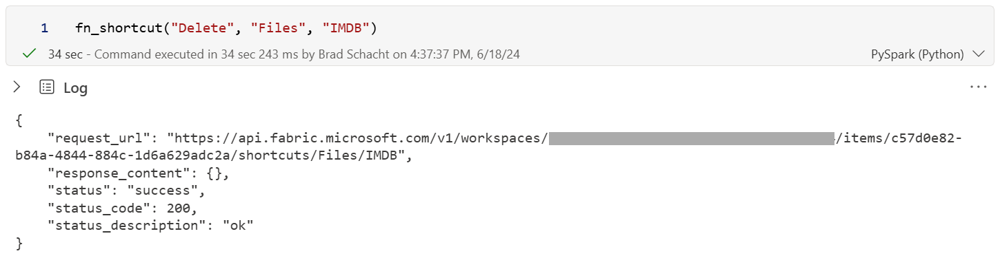
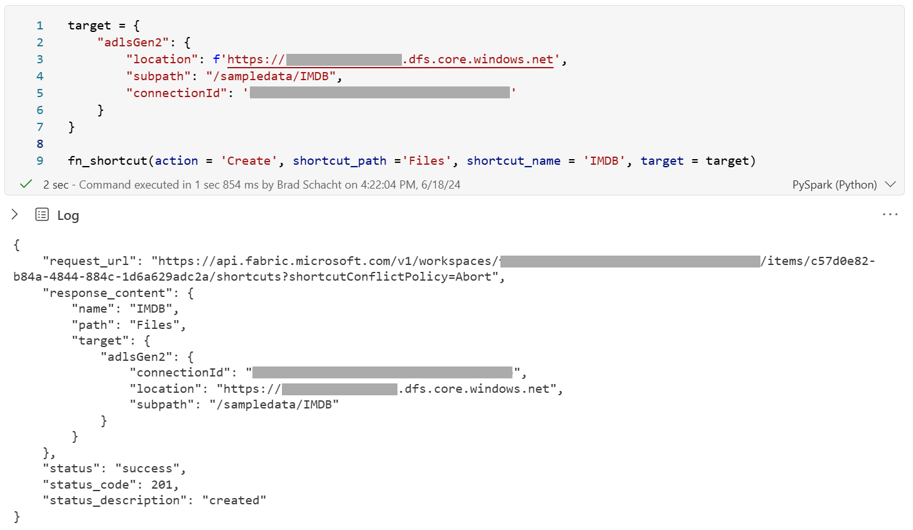
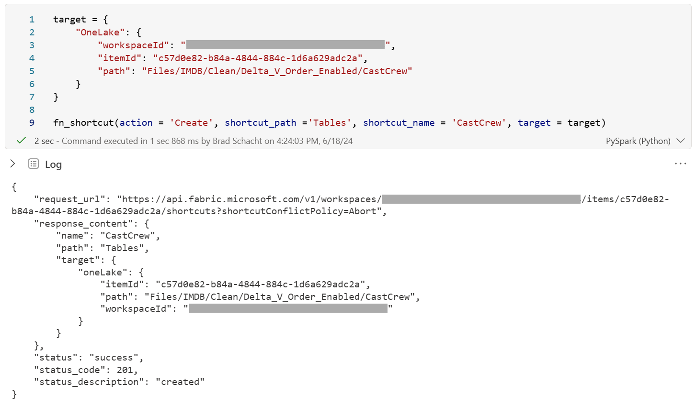
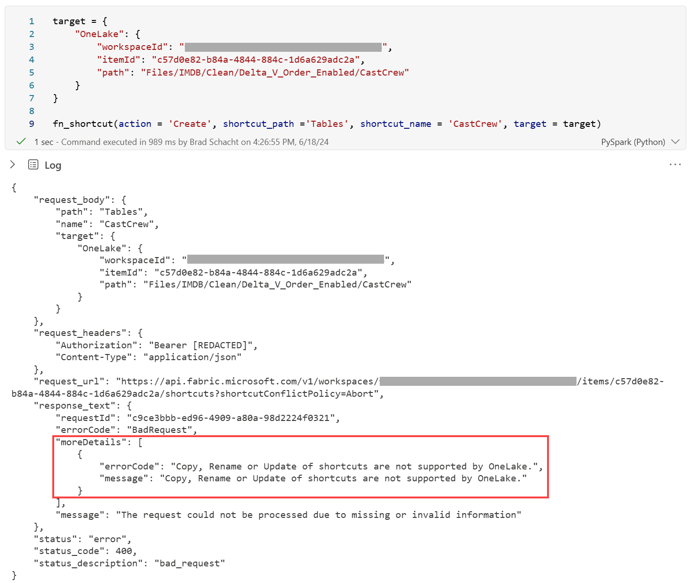

[Shortcuts](https://learn.microsoft.com/en-us/fabric/onelake/onelake-shortcuts) are an important part of the Fabric story. They allow you to access data in storage (OneLake, ADLS Gen2, AWS S3, etc.) without having to copy the data into Fabric. They have many uses including:

* Creating a hub and spoke architecture (OneLake shortcut)
    
* Leveraging an existing data lake (ADLS Gen2 shortcut)
    
* Accessing data prepared in another compute engine (ADLS Gen2 shortcut)
    
* Using data from other clouds for analysis (AWS S3 shortcut)
    
* Connecting to on-prem data (S3 compatible shortcut with the on-prem data gateway)
    

There are two ways to create shortcuts:

* The Fabric UX
    
* Fabric APIs
    

Today, focus is on the APIs.

I often build and tear down demos or testing environments on a regular basis which means I like to have code-based configuration options. Many customers want to do similar things or need to create dozens of shortcuts and want to reduce the click tax of the UX.

Like many things in Python, I have to go back and reference how to do them multiple times. I'm a SQL person after all. When I can build a way for me to not need to write extra code or go back to the docs then I'm going to do it. That's exactly what I've done with the shortcut maintenance.

Here is the function I've built. It is just a wrapper for the Get, Create, and Delete APIs where I can pass the relevant items without needing to go rebuild the request URLs each time and also returns the status and any errors, so I don't have to go capture those each time. We'll discuss the parameters for this function shortly.

```python
import json
import requests
from requests import status_codes
import sempy.fabric as fabric
import time

def fn_shortcut(action, shortcut_path, shortcut_name, target = None):
    
    request_headers = {
        "Authorization": "Bearer " + mssparkutils.credentials.getToken("pbi"),
        "Content-Type": "application/json"
    }

    request_body = {
        "path": shortcut_path,
        "name": shortcut_name,
        "target": target
    }

    lakehouse_id = fabric.get_lakehouse_id()
    workspace_id = fabric.get_workspace_id()

    # Get a shortcut
    if action == 'Get':
        response = requests.request(method = "GET", url = f'https://api.fabric.microsoft.com/v1/workspaces/{workspace_id}/items/{lakehouse_id}/shortcuts/{shortcut_path}/{shortcut_name}', headers = request_headers)

    # Create a shortcut
    if action == 'Create':
        response = requests.request(method = "POST", url = f'https://api.fabric.microsoft.com/v1/workspaces/{workspace_id}/items/{lakehouse_id}/shortcuts?shortcutConflictPolicy=Abort', headers = request_headers, json = request_body)

    # Delete a shortcut
    if action == 'Delete':
        response = requests.request(method = "DELETE", url = f'https://api.fabric.microsoft.com/v1/workspaces/{workspace_id}/items/{lakehouse_id}/shortcuts/{shortcut_path}/{shortcut_name}', headers = request_headers)
        
        if response.status_code == 200:
            # Wait for the delete operation to fully propogate
            while mssparkutils.fs.exists(f'{shortcut_path}/{shortcut_name}'):
                time.sleep(5)

    # Build the return payload for a success response
    if (response.status_code >= 200 and response.status_code <= 299):
        response_content = {
            "request_url"           : response.url,
            "response_content"      : {} if response.text == '' else json.loads(response.text),
            "status"                : "success",
            "status_code"           : response.status_code,
            "status_description"    : status_codes._codes[response.status_code][0]
            }
            
    # Build the return payload for a failure response
    if not (response.status_code >= 200 and response.status_code <= 299):
        response_content = {
            "request_body"          : request_body,
            "request_headers"       : request_headers,
            "request_url"           : response.url,
            "response_text"         : json.loads(response.text),
            "status"                : "error",
            "status_code"           : response.status_code,
            "status_description"    : status_codes._codes[response.status_code][0]
        }
    
    return response_content
```

Before we look at how I use this function, let's understand the properties for each API call so you have a reference point for the function's parameters. You will need to attach the notebook to a lakehouse and gather a little bit of information about your shortcut depending on what you are trying to accomplish (Get, Create, or Delete).

# Information for all API calls

All the API calls need a few pieces of information for assembling the various URIs and authentication while create shortcut needs a few additional pieces of information. For each API call you will need:

* Lakehouse ID (The script will get this for you. Remember to attach a lakehouse.)
    
* Workspace ID (The script will get this for you.)
    
* Header which passes the bearer token (The script will get this for you.)
    

## Get shortcut

The [Get Shortcut API](https://learn.microsoft.com/en-us/rest/api/fabric/core/onelake-shortcuts/get-shortcut?tabs=HTTP) returns the properties of the shortcut. Different values may be returned for OneLake vs. external shortcuts. You need:

* Shortcut Path (The relative location in the lakehouse like Files/Folder)
    
* Shortcut Name (The name of the shortcut like MyShortcut in the path Files/Folders/MyShortcut)
    

## Delete shortcut

The [Delete Shortcut API](https://learn.microsoft.com/en-us/rest/api/fabric/core/onelake-shortcuts/delete-shortcut?tabs=HTTP) deletes an existing shortcut. You probably could have guessed that. For this you need the same properties as Get and, just like using Get, the Lakehouse and Warehouse IDs will be captured for you.

## Create shortcut

The [Create Shortcut API](https://learn.microsoft.com/en-us/rest/api/fabric/core/onelake-shortcuts/create-shortcut?tabs=HTTP) is where things get a little more complicated because we need to pass a request body which is slightly different for each type of shortcut that is created. The reference for those can be found in the [Create Shortcut - Target](https://learn.microsoft.com/en-us/rest/api/fabric/core/onelake-shortcuts/create-shortcut?tabs=HTTP#target) docs. Because I mainly use ADLS Gen2 and OneLake shortcuts, I will include those here. Check out the docs for the others.

### ADLS Gen2

There are three pieces of information to replace in the code below:

* Location is the storage account URI
    
* Subpath is the directory to which the shortcut will point, including the container name
    
* Connection ID is the Fabric connection ID to the storage account which includes how you will be authenticating to the storage account (Click the **gear icon** in the top right corner of the screen. Select **Manage connections and gateways.** View the settings for the connection from the list. Locate the **Connection ID**.)
    

```python
target = {
    "adlsGen2": {
        "location": "https://StorageAccountNameHere.dfs.core.windows.net",
        "subpath": "/container/folder",
        "connectionId": "xxxxxxxx-xxxx-xxxx-xxxx-xxxxxxxxxxxx"
    }
}
```

### OneLake

OneLake is a bit more straightforward because there is no connection involved. Just provide the workspace id, lakehouse id, and folder path where the data resides. The path can be to the Files or Tables section.

```python
target = {
    "OneLake": {
        "workspaceId": workspace_id,
        "itemId": lakehouse_id,
        "path": "Files/SomeFolder/SubFolder'
            }
        }
```

# Bringing it all together

Now that we know what we need to provide getting, deleting, and creating shortcuts, let's circle back to our Python function. For my example, I am using a lakehouse that contains some IMDB data.

You will recall that our function is doing a bit of work for us, so we don't need to provide every single piece of information. The function has 3 required and one optional parameter.

* **action** is required and accepts Get, Create, and Delete to indicate the operation you want to complete.
    
* **shortcut\_path** is required and should be the path up to, but not including the name of the shortcut. Where we have a shortcut at Files/MyFolder/MyShortcut this parameter would be **Files/MyFolder**.
    
* **shortcut\_name** is required and should be the name of the shortcut itself. Where we have a shortcut at Files/MyFolder/MyShortcut this parameter would be **MyShortcut**.
    
* **target** is optional and only needs to be passed when creating a shortcut. This is the payload that describes where the shortcut points and how to authenticate as shown in the prior two sections for ADLS Gen2 and OneLake.
    

Let's show the function in action!

## Get shortcut

Getting shortcut information is super simple. Just pass the Get action, path, and name.

```python
fn_shortcut("Get", "Files", "IMDB")
# Or make the output pretty with this command
# print(json.dumps(fn_shortcut("Get", "Files", "IMDB"), indent = 4))
```



## Delete shortcut

Deleting a shortcut is just as easy. This command does take a little bit longer to run because I have some code that checks to make sure the background cleanup operations complete before returning. You can remove that from the function is you don't want it.

```python
fn_shortcut("Delete", "Files", "IMDB")
# Or make the output pretty with this command
# print(json.dumps(fn_shortcut("Delete", "Files", "IMDB"), indent = 4))
```



## Create shortcut

For creating shortcuts don't forget about the additional parameter that defines the shortcut's target. I will include two examples, one for OneLake and one for ADLS Gen2.

```python
target = {
    "adlsGen2": {
        "location": f'https://scbradlstorage01.dfs.core.windows.net',
        "subpath": "/sampledata/IMDB",
        "connectionId": 'dd8ae71c-dcd7-4550-88cd-caba775f786b'
    }
}

fn_shortcut(action = 'Create', shortcut_path ='Files', shortcut_name = 'IMDB', target = target)
# Or make the output pretty with this command
# print(json.dumps(fn_shortcut(action = 'Create', shortcut_path ='Files', shortcut_name = 'IMDB', target = target), indent = 4))
```



```python
target = {
    "OneLake": {
        "workspaceId": "fdddc13a-f994-4b62-85ed-bbf7633ede24",
        "itemId": "c57d0e82-b84a-4844-884c-1d6a629adc2a",
        "path": "Files/IMDB/CastCrew"
    }
}

fn_shortcut(action = 'Create', shortcut_path ='Tables', shortcut_name = 'CastCrew', target = target)
# Or make the output pretty with this command
# print(json.dumps(fn_shortcut(action = 'Create', shortcut_path ='Tables', shortcut_name = 'CastCrew', target = target), indent = 4))
```



## Error handling

There is a little bit of error handling in the function as well. If a shortcut exists and you try to create it or if you attempt to delete or get a shortcut that doesn't exist, the errors will be captured and returned with all the relevant information. For example, if I rerun the previous command it will try to create a shortcut that already exists. Parsing out the error message, we can see that Copy, Rename or Update of shortcuts are not supported by OneLake which indicates the shortcut is there so I can't modify it.



# Wrapping it up

There you have it. A single Python function that will allow you to reuse the Fabric Shortcut APIs.

What do you think?